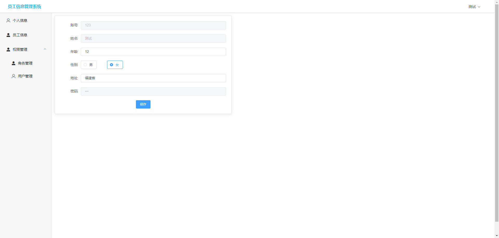
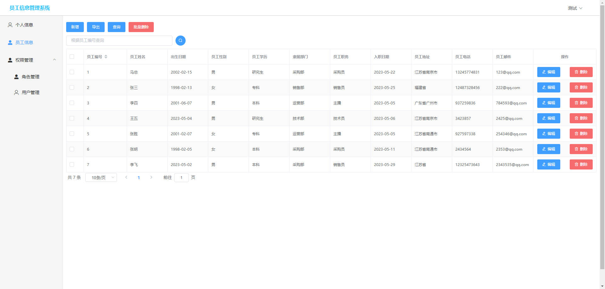
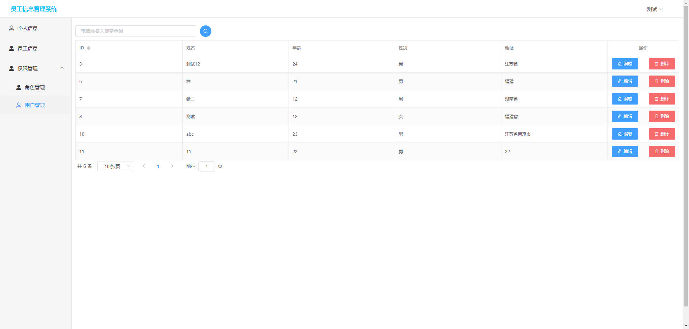
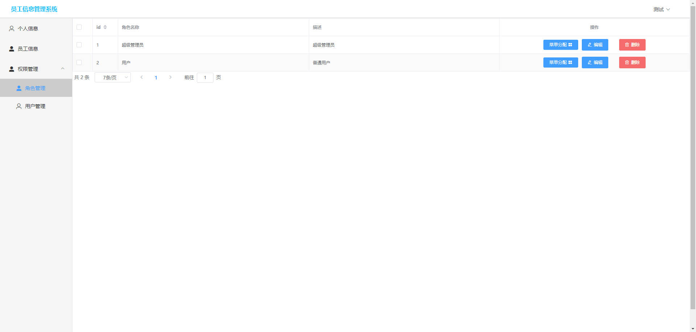
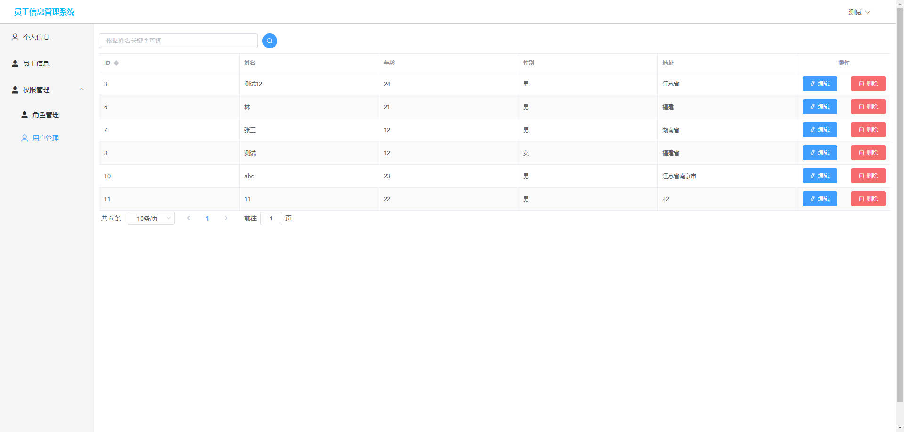

# 基于Springboot的员工管理系统

# Springboot-061

### 技术栈

Springboot mybatisplus vue

## 数据库

mysql (5张表)


## 功能描述


## 运行截图

### 前台

### 后台






## 访问网址

### 前台

```

```

### 后台

```
http://localhost:9876

账号 123
密码 123
```


##  技术交流或打赏


